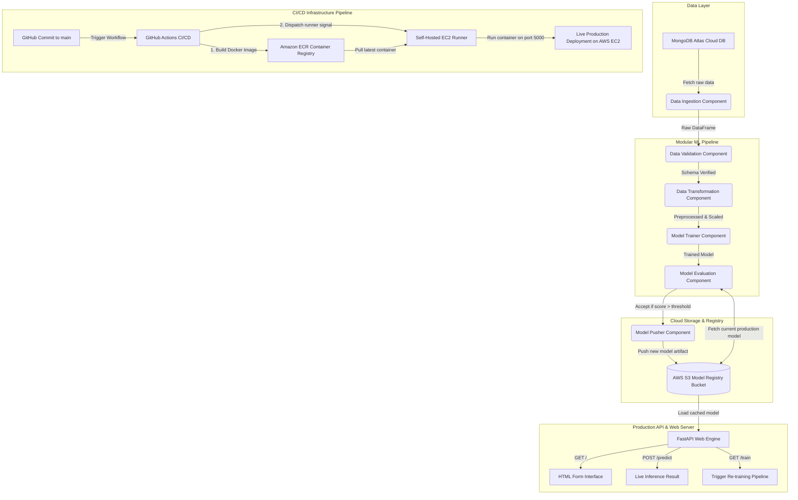
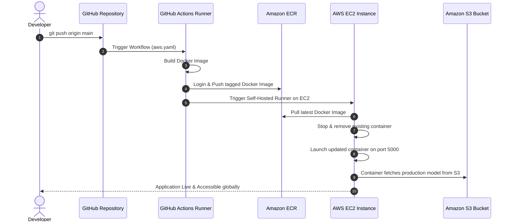

# 🚗 AutoGuard MLOps: End-to-End Vehicle Insurance Cross-Sell Production Pipeline

[](https://www.python.org/)
[](https://fastapi.tiangolo.com/)
[](https://www.mongodb.com/cloud/atlas)
[](https://aws.amazon.com/ecr/)
[](https://aws.amazon.com/ec2/)
[](https://aws.amazon.com/s3/)
[](https://www.docker.com/)
[](https://github.com/riteshray007/VEHICLE-INSURANCE-MLOPS/actions)

An enterprise-grade, fully automated **MLOps Engineering Solution** for predicting health insurance customers' interest in purchasing Vehicle Insurance (Cross-Sell Prediction). Built with strict **modular, object-oriented programming (OOP)** practices, robust exception handling, custom logging, automated model evaluation & pushing to **AWS S3**, and seamless **CI/CD deployment to AWS EC2 via Amazon ECR and GitHub Actions self-hosted runners**.

🌐 **Live Web Application Demo**: [http://52.205.78.126:5000](http://52.205.78.126:5000) *(Note: Hosted on AWS EC2; active during cloud deployment)*  
🐙 **GitHub Repository**: [https://github.com/riteshray007/VEHICLE-INSURANCE-MLOPS.git](https://github.com/riteshray007/VEHICLE-INSURANCE-MLOPS.git)

---

## 📸 Web Application Screenshots

The web application exposes interactive endpoints for real-time inference and automated model retraining:

| 1️⃣ Input Vehicle & Customer Details | 2️⃣ Instant Real-Time Prediction Output |
| :---: | :---: |
|  |  |

---

## 🏗️ End-to-End MLOps System Architecture



---

## ✨ Key Features & Architectural Highlights

### 1. 📦 Industry-Standard Modular & OOP Architecture
- **Separation of Concerns**: Pipeline components (`DataIngestion`, `DataValidation`, `DataTransformation`, `ModelTrainer`, `ModelEvaluation`, `ModelPusher`) are decoupled into standalone Python classes.
- **Config & Artifact Management**: Data schemas, directory configurations, and artifact outputs are encapsulated cleanly within `ConfigEntity` and `ArtifactEntity` dataclasses.
- **Custom Logging & Exception Handling**: Context-aware logger (`src/logger.py`) and explicit traceback exception wrapping (`src/exception.py`) capture line numbers, file names, and full error context for production debugging.

### 2. 🗄️ Cloud Data Management (MongoDB Atlas)
- Dynamic data connection pipeline via `src/configuration/mongo_db_connections.py` and `src/data_access/proj1_data.py`.
- Automated ingestion of raw data directly from MongoDB Atlas into Python pandas DataFrames.

### 3. 🔍 Automated Schema Validation & Transformation
- **Schema Validation**: Validates numerical/categorical columns and data types against `config/schema.yaml`.
- **Feature Engineering & Preprocessing**: Handles missing values, performs scaling, encoding, and robust data transformations wrapped into a reusable pipeline object (`estimator.py`).

### 4. 🤖 Model Evaluation & Automated S3 Model Registry
- **AWS S3 Integration**: Integrates directly with AWS S3 (`my-model-mlopsproj`) serving as the central model repository.
- **Continuous Evaluation**: During retraining, the newly trained model is evaluated against the current production model fetched from S3. The new model is accepted and pushed to S3 only if it satisfies the accuracy improvement threshold (`MODEL_EVALUATION_CHANGED_THRESHOLD_SCORE`).

### 5. ⚡ FastAPI Production Web Server
- Real-time prediction interface built with **FastAPI** and **Jinja2** templating (`app.py`).
- Asynchronous form handling (`DataForm`) with zero blocking operations.
- In-memory model caching (`VehicleDataClassifier`) for high-speed inference without network latency on every request.
- Hot-reloading model refresh upon successful execution of the `/train` endpoint.

### 6. 🚀 Automated CI/CD & AWS Cloud Deployment
- **Dockerized Runtime**: Multi-stage `Dockerfile` creating isolated, clean execution environments.
- **Amazon ECR Storage**: Container images built and tagged automatically (`${{ github.sha }}`) on every commit to `main`.
- **GitHub Actions & Self-Hosted Runner**: Automated deployment pipeline configured on AWS EC2 via GitHub Actions self-hosted runners (`.github/workflows/aws.yaml`). Old containers are safely removed and updated versions spun up smoothly.

---

## 📂 Codebase Repository Structure

```
VEHICLE-INSURANCE-MLOPS/
├── .github/
│   └── workflows/
│       └── aws.yaml                 # GitHub Actions CI/CD Deployment Workflow
├── config/
│   └── schema.yaml                  # Data validation rules & schema definition
├── notebook/
│   ├── data.csv                     # Raw dataset
│   ├── mongodb_demo.ipynb           # MongoDB connection & data ingestion notebook
│   └── vehicle_insurance_experiment.ipynb  # EDA & ML model experimentation
├── notes/
│   └── workflow.txt                 # Step-by-step development log
├── src/
│   ├── aws_storage/                 # S3 connection and storage helper classes
│   ├── components/                  # Pipeline components (Ingestion, Validation, Transformation, etc.)
│   ├── configuration/               # AWS & MongoDB connection handlers
│   ├── constants/                   # Environment & pipeline constants
│   ├── data_access/                 # MongoDB data extraction logic
│   ├── entity/                      # Dataclasses for config, artifacts, and estimators
│   ├── pipeline/                    # Training and Prediction pipeline orchestration
│   ├── utils/                       # File I/O & YAML helper utility functions
│   ├── exception.py                 # Custom exception handler with full stack trace logger
│   └── logger.py                    # Production logging module
├── static/                          # CSS stylesheet assets for UI
├── templates/                       # HTML templates (vehicledata.html)
├── app.py                           # FastAPI application & entry point
├── demo.py                          # Local pipeline verification script
├── Dockerfile                       # Container definition file
├── requirements.txt                 # Project dependencies
├── setup.py                         # Local package installation setup
└── pyproject.toml                   # Project metadata configuration
```

---

## 🛠️ Tech Stack & Tools Used

| Domain | Technologies / Services |
| :--- | :--- |
| **Languages & Frameworks** | Python 3.10, FastAPI, Uvicorn, Jinja2, HTML/CSS |
| **Machine Learning & Data** | Scikit-Learn, Pandas, NumPy, XGBoost / CatBoost / Random Forest |
| **Cloud Services (AWS)** | Amazon EC2 (Ubuntu Server 24.04), Amazon ECR, Amazon S3, AWS IAM |
| **Database** | MongoDB Atlas Cloud Database |
| **DevOps & CI/CD** | Docker, GitHub Actions (Self-Hosted Runner), Git |

---

## ⚙️ Step-by-Step Local Setup & Execution Guide

Follow these steps to set up and run the project locally on your machine:

### Prerequisites
- Python 3.10 installed
- Git installed
- MongoDB Atlas cluster URL
- AWS Account with S3 Bucket & ECR repository set up

### Step 1: Clone the Repository
```bash
git clone https://github.com/riteshray007/VEHICLE-INSURANCE-MLOPS.git
cd VEHICLE-INSURANCE-MLOPS
```

### Step 2: Create & Activate Virtual Environment
```bash
# Using Conda
conda create -n vehicle python=3.10 -y
conda activate vehicle

# Or using venv
python -m venv venv
# Linux/Mac: source venv/bin/activate
# Windows: .\venv\Scripts\activate
```

### Step 3: Install Dependencies
```bash
pip install --upgrade pip
pip install -r requirements.txt
pip install -e .
```

### Step 4: Set Up Environment Variables
Export the required cloud environment variables:

**On Windows (PowerShell):**
```powershell
$env:MONGODB_URL="mongodb+srv://<username>:<password>@cluster.mongodb.net/?retryWrites=true&w=majority"
$env:AWS_ACCESS_KEY_ID="your_aws_access_key"
$env:AWS_SECRET_ACCESS_KEY="your_aws_secret_key"
$env:AWS_DEFAULT_REGION="us-east-1"
```

**On Linux / macOS (Bash):**
```bash
export MONGODB_URL="mongodb+srv://<username>:<password>@cluster.mongodb.net/?retryWrites=true&w=majority"
export AWS_ACCESS_KEY_ID="your_aws_access_key"
export AWS_SECRET_ACCESS_KEY="your_aws_secret_key"
export AWS_DEFAULT_REGION="us-east-1"
```

### Step 5: Run the FastAPI Application
```bash
python app.py
```
Open your browser and navigate to:
- **Web Interface**: `http://localhost:5000`
- **Interactive Swagger Docs**: `http://localhost:5000/docs`
- **Trigger Pipeline Retraining**: `http://localhost:5000/train`

---

## 🐳 Docker Local Setup Guide

If you prefer running the application inside a container:

### Step 1: Build the Docker Image
```bash
docker build -t vehicle-insurance-app .
```

### Step 2: Run the Docker Container
```bash
docker run -d \
  --name vehicle-insurance \
  -p 5000:5000 \
  -e MONGODB_URL="your_mongodb_connection_string" \
  -e AWS_ACCESS_KEY_ID="your_aws_access_key" \
  -e AWS_SECRET_ACCESS_KEY="your_aws_secret_key" \
  -e AWS_DEFAULT_REGION="us-east-1" \
  vehicle-insurance-app
```

Access the application at `http://localhost:5000`.

---

## ☁️ AWS Cloud Infrastructure & Deployment Architecture



### GitHub Repository Secrets Required for Deployment
Set the following secrets in **GitHub Repo -> Settings -> Secrets and variables -> Actions**:

| Secret Name | Description |
| :--- | :--- |
| `AWS_ACCESS_KEY_ID` | AWS IAM User Access Key ID with S3 & ECR permissions |
| `AWS_SECRET_ACCESS_KEY` | AWS IAM User Secret Access Key |
| `AWS_DEFAULT_REGION` | AWS Region (e.g., `us-east-1`) |
| `ECR_REPO` | Name of your Amazon ECR Repository (e.g., `vehicleproj`) |
| `MONGODB_URL` | MongoDB Atlas Cloud Connection String |

---

## 🤝 Contributing & License
Contributions are welcome! Please feel free to open an Issue or submit a Pull Request.

This project is open-source and available under the [MIT License](LICENSE).
